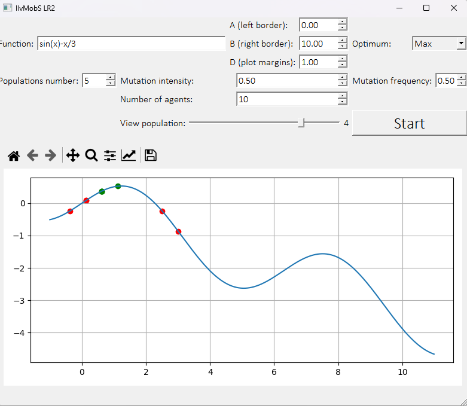

# IIvMobS-LR2
#### Практическое занятие № 2 (по теме 4). РАЗРАБОТКА ГЕНЕТИЧЕСКОГО АЛГОРИТМА ПОИСКА ЭКСТРЕМУМА ФУНКЦИИ

----------

## Что с этим делать?

**Внимание:** Собранные образы для Windows x64 в **релизах** НЕ требуют установки Python

1. Попытайтесь прочитать задание (в репозитории есть PDF-файл) и понять что это приложение должно делать =))))
2. Скачайте приложение из релизов и распакуйте его (папку `IIvMobS-LR2-X.X.X-Windows-AMD64`). _**ИЛИ**_, установите Python, скачайте репозиторий и установите пакеты, указанные в файле (`python -m pip install -r requirements.txt`)
3. Выберите интерфейс из таблицы ниже, который вам больше нравится. Скачайте соответствующий .ui файл (также, находится в архиве в релизах) и **переименуйте** его в `gui.ui`
4. Переместите полученный файл `gui.ui` в папку `_internal`, которая находится внутри скаченной папки `IIvMobS-LR2-X.X.X-Windows-AMD64` (в случае использования собранной версии). _**ИЛИ**_, в случае использования исходного кода, переместите файл `gui.ui` в туже папку, в которой находится основной скрипт `main.py`. **Без файла `gui.ui` ПРИЛОЖЕНИЕ РАБОТАТЬ НЕ БУДЕТ**
5. Запустите приложение, используя файлы `IIvMobS-LR2-1.0.0-Windows-AMD64-fusion.exe` или `IIvMobS-LR2-1.0.0-Windows-AMD64-windows.exe` для **желаемого стиля интерфейса**. _**ИЛИ**_, в случае использования исходного кода, запустите основной скрипт при помощи команды `python main.py`
6. Из секции `Варианты` выберите свои формулы, согласно таблице (`Код студента` в личном кабинете (старая версия), последняя цифра) и вставьте их по одной в поле вводы функции на форме. **Внимание**: в случае наличия в формуле степени (например `x^2`), замените это на умножение (`x*x`)
7. Установите настройки генерации, используя элементы на форме
8. Нажмите кнопку Start / Старт / Вычислить, для вычисления всех популяций
9. Используя слайдер, выберите популяцию для отображения
10. Сделайте скриншоты и заполните отчёт. Сохраните отчёт как PDF
11. Загрузите отчёт по ссылке [https://online.mospolytech.ru/mod/assign/view.php?id=290648](https://online.mospolytech.ru/mod/assign/view.php?id=290648)

p.s. Если вы хотите собрать .exe файл, установите `pyinstaller` и выполните команду `pyinstaller IIvMobS-LR2.spec`


### Таблица примеров GUI

| стиль   | gui_вертикальное_русское.ui, gui_Fern_Lane.ui             | gui_сетка_английское.ui, gui_сетка_русское.ui         | gui_ущербное_английское.ui, gui_ущербное_русское.ui      |
|---------|-----------------------------------------------------------|-------------------------------------------------------|----------------------------------------------------------|
| fusion  |   |   |   |
| windows |  |  |  |


----------

## Задание

```
Реализовать на языке программирования (по Вашему выбору) программу поиска оптимума (максимума/минимума) функции F(X) на интервале [A,B]  с использованием генетического алгоритма.

Требования к программе:

1.     Ввод значения интервалов A и B

2.     Ввод типа оптимума: минимум или максимум

3.     Ввод количества популяций генетического алгоритма.

4.     Ввод параметра d-отображения графика (см.ниже).

5.     По желанию: ввод/изменение параметров генетического алгоритма:

a.      Размер популяции.

b.     Вероятность cut-point.

c.      Коэффициент скрещивания.

d.     Коэффициент мутации.

e.      Что-то еще – на усмотрение разработчика.

6.     Отображение графика функции на интервале [A–d, B+d], где d-задается (см.выше).

7.     Отображение на графике функции популяций на каждом шаге, зеленым цветом выделять наиболее жизнеспособные, красным – наименее.

8.     Исследовать работу алгоритма на различных функциях (по варианту, см ниже).

 

Пример выполнения работы 

Разработку будем вести на языке Python. Нам понадобятся следующие Фреймворки (устанавливаем в терминалеPyCharm по команде pip):

1.     PyQt5 – Пользовательский интерфейс(GUI): форма для ввода параметров: pip install PyQt5.

2.     Sympy – библиотека, для обработки вводимых пользователем функций: pip install sympy.

3.     Numpy – математическая библиотека: pip install numpy

4.     Matplotlib – библиотека для создания графиков: pip install matplotlib 

 Разработаем класс для «особи» (точки на плоскости), назовем этот класс Agent. Агент может посчитать свое Y-значение (фактически вычислить фитнесс-функцию), а также провести операцию мутации (сделать случайных «отскок» по оси X). В функцию мутации передаются параметры – сила мутации (strange) и частота (chast). Сила мутации в данном примере представляет собой величину вариации по оси Х, т.е. на какое значение интервала от исходной «особи» (точки) будет создана новая «мутированная особь» (новая точка). Сила мутации может быть также задана случайным образом.
Разработаем класс самого приложения – mywindow.

1.     Конструктор _init__ отвечает за инициализацию стартовых значений (здесь связь их с полями интерфейса)

2.     Функция Start – главная функция приложения. В этой функции происходит следующее:

·        Инициализация значений.

·        Обработка введенной функции.

·        Создание первого поколения агентов.

·        Цикл где ищутся худшие особи, чтобы их впоследствии отсеять (оставляем 50 процентов).

·        Добавляются точки на график.

·        Создаются новые особи (агенты) и происходит их мутация.

Оставшиеся функции вспомогательные, комментарии к ним приведены в листинге.

A – задаем левую границу, B – задаем правую границу, D – плюс к отображению.

Оптимум – ищем максимумы или минимумы.

Кол-во популяций – сколько будет создано популяций.

Интенсивность мутации – на какое значение в + или – мутирует агент.

Частота мутации – вероятность мутации.

Количество особей – количество агентов в поколении.

Кнопка старт – начало работы.

Слайдер – после окончания работы, позволит перемещаться по поколениям.
```

----------

## Варианты

```
Варианты заданий

В таблице ниже указан номер варианта и звёздочкой – номер функции для исследования. В каждом варианте 3 функции.

Список функций для исследования.

 

1.     F(x) = sin(x)-x/3

2.     F(x) = sin(x)+x/3

3.     F(x) = cos(x)-x/3

4.     F(x) = cos(x)+x/3

5.     F(x) = 2*x*sin(x)-x/5

6.     F(x) = 3* sin(x)-x/3

7.     F(x) = 4* x*sin(x)+x/4

8.     F(x) = 2*sin(x)+x/5

9.     F(x) = 3* x*sin(x)+x/3

10. F(x) = 4*sin(x)+x/4

11. F(x) = 2* cos (x)-x/5

12. F(x) = 3* x*cos (x)-x/3

13. F(x) = 4* cos (x)+x/4

14. F(x) = 2* x*cos (x)+x/5

15. F(x) = 3* cos (x)+x/3

16. F(x) = 4* x*cos (x)+x/4

17. F(x) = 2* x*sin(x)+x*cos(x)

18. F(x) = 3*sin(x)-x*cos(x)/3

19. F(x) = 4* x*sin(x)+x*cos(x)

20. F(x) = 5*cos(x)-x*cos(x)/2

21. F(x) = 2* x*cos(x)+x* sin (x)

22. F(x) = 3*cos(x)-x* sin (x)/3

23. F(x) = 4* x*cos(x)+x* sin (x)

24. F(x) = 5*cos(x)-x* sin (x)/2

25. F(x) = cos(x)*x* sin (x)/3

26. F(x) = 5*cos(x)*x^2* sin (x)

27. F(x) = cos(x)*x^2/5-sin (x)
```


